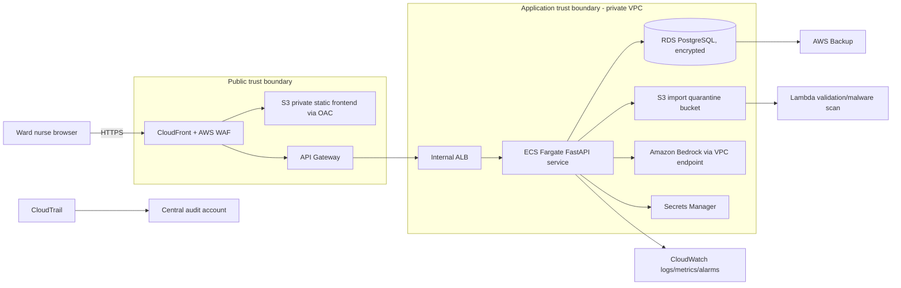

# AI Clinical Shift Assistant

A 24-hour synthetic-data proof of concept for ward nurses. It supports login, patient filtering, validated CSV/JSON patient import, grounded Q&A with citations and missing-evidence warnings, patient summaries, draft SBAR handovers, deterministic escalation alerts, explained task prioritisation, persistent alert acknowledgements and task updates, and audit logging.

> **Synthetic-data prototype. Verify all information using approved clinical systems and processes. This tool does not provide diagnosis, treatment or medication advice.**

## Fastest Windows start

Double-click `START_APP.bat`. It creates `.venv`, installs the required packages, starts the backend and frontend, and opens the login page. Keep the two server windows open.

- Username: `nurse`
- Password: `Nurse123!`

Run `RUN_TESTS.bat` after setup to execute the automated tests.

## Setup

Requires Python 3.11+.

```powershell
python -m venv .venv
.venv\Scripts\activate
pip install -r requirements.txt
uvicorn backend.main:app --reload
```

In a second terminal:

```powershell
cd frontend
python -m http.server 5500
```

Open `http://127.0.0.1:5500/index.html`.

### Demo credentials

- Username: `nurse`
- Password: `Nurse123!`

### Environment variables and model choice

Copy `.env.example` values into your shell or environment. `BEDROCK_MODEL_ID` selects an Amazon Bedrock text model supported by the Converse API, and `AWS_REGION` selects its region. Credentials are not stored in this repository; boto3 uses the standard AWS credential chain.

The application grounds prompts in database records before requesting generation. Bedrock is used for summary/SBAR wording when configured. Without Bedrock access, a deterministic local grounded fallback is used so the local demo still works. The fallback is a known limitation and must not be described as a real model demonstration.

## Main workflow

1. Log in.
2. View/filter the ward list. Escalated patients show the triggering rule and observation timestamp.
3. Import `data/sample_import_patient.json`, or another valid patient CSV/JSON file.
4. Open a patient and ask a record-based question.
5. Review the cited answer or prominent warning when exact evidence is missing.
6. Review the grounded summary and SBAR, including allergies.
7. Review deterministic alerts and explained task ordering.
8. Acknowledge an alert or complete a task; refresh to verify persistence.
9. Log out.

## API endpoints

Interactive documentation: `http://127.0.0.1:8000/docs`

- `POST /login`, `POST /logout`
- `GET /patients?search=&ward=`, `GET /patients/{id}`
- `POST /imports/patients`
- `GET /patients/{id}/observations`, `/tasks`, `/alerts`
- `POST /questions`
- `GET /patients/{id}/summary`, `/sbar`
- `GET /tasks/prioritised`
- `POST /alerts/acknowledge`
- `PATCH /tasks/{task_id}/complete`
- `GET /audit-log`

Protected endpoints require `Authorization: Bearer <token>`. Validation errors use controlled HTTP 4xx responses.

## Tests

```powershell
pytest -q
```

Tests cover protected access, filtering/rule output, malformed import validation, and missing-information warning behaviour.

## Data and persistence

SQLite stores patients, observations, tasks, acknowledgements and audit events in `clinical_assistant.db`. Initial synthetic CSV data is seeded only when the patient table is empty. Alert thresholds come only from `data/escalation_rules.json`; AI does not create thresholds.

## AWS deployment architecture (design only - do not deploy for this assessment)



**Data flow and controls:** the browser receives static files through CloudFront. API requests pass through WAF and API Gateway, then an internal load balancer to private ECS tasks. Authentication would use Cognito in production rather than the demo in-memory token. Imports are size/type checked, quarantined in S3 and validated before database insertion. Patient context sent to Bedrock is synthetic/minimised, with private connectivity and IAM least privilege. RDS, S3, logs and backups use KMS encryption. Secrets remain in Secrets Manager. CloudWatch and CloudTrail provide operational and security audit trails. Public, application and data/AI trust boundaries are separated.

## Assumptions and known limitations

- Synthetic data only; not a medical device and not suitable for clinical use.
- Demo sessions are held in memory and reset when the backend restarts.
- The import workflow adds patient demographic records; observations/tasks remain supplied by the original dataset/API.
- Datetimes in the supplied dataset are displayed as recorded; production would enforce a single timezone policy.
- The simple Q&A retriever recognises common ward terms and deliberately warns instead of guessing.
- Bedrock requires the evaluator's AWS credentials and model access.

## AI tooling disclosure

OpenAI ChatGPT was used as a coding assistant to review the brief, propose implementation changes, write/refactor code and documentation, and create tests. The candidate is responsible for reviewing, understanding and explaining every submitted line. No secrets or patient data were supplied; the dataset is synthetic.

## Submission hygiene

Do not commit `.venv`, `__pycache__`, `.pytest_cache`, `.env`, AWS credentials or local editor files. The supplied `.gitignore` excludes them.
